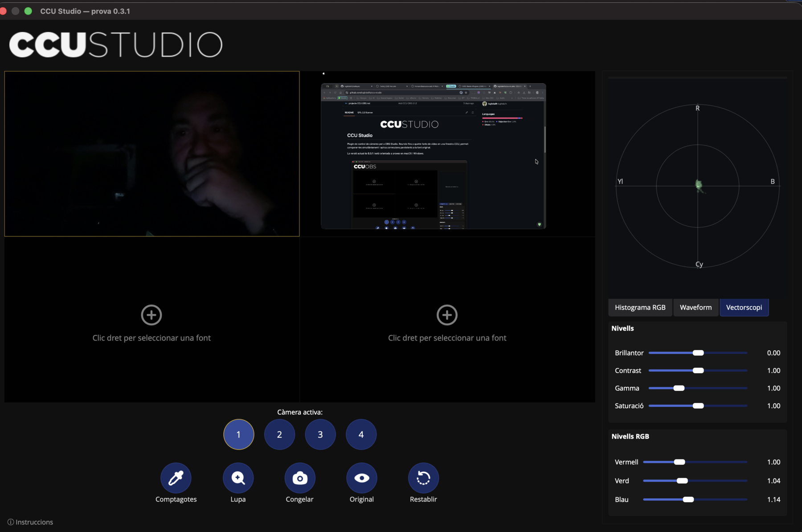

<p align="center">
  
</p>

# CCU Studio

Plugin de control de càmeres per a OBS Studio. Reuneix fins a quatre fonts de
vídeo en una finestra CCU, permet comparar-les simultàniament i aplica
correccions persistents a la font original.

La versió actual és **0.3.1** i està orientada a proves en macOS i Windows.



## Funcions actuals

- Finestra independent oberta des del menú d'eines d'OBS.
- Mosaic de quatre visors 16:9, separats per 1 píxel, que reutilitzen fonts
  ja obertes per OBS.
- Assignació independent de fonts i selecció de la càmera activa.
- Controls RGB, brillantor, contrast, gamma i saturació.
- Aplicació immediata mitjançant un filtre GPU propi.
- Comptagotes restringit al rectangle real del vídeo.
- Lupa aproximada de 18×, retícula i punt central de selecció.
- Vista ampliada de la càmera activa.
- Referència congelada simultània de l'histograma, waveform i vectorscopi
  per comparar dues càmeres.
- Comparació partida original/correcció només dins del visor actiu, sense
  alterar la sortida, la gravació ni l'emissió d'OBS.
- Persistència del filtre a la font i de les assignacions del CCU.
- Mida inicial adaptativa, centrada, amb proporció 5:3 i limitada al 85% de
  l'àrea útil de l'escriptori (màxim 1650 × 990 píxels lògics).

## Ús ràpid

1. Obre OBS i selecciona **Eines → CCU Studio…**.
2. Fes clic dret sobre cada visor per assignar-hi una font. Selecciona la
   càmera activa amb els botons `1`–`4` o clicant el visor.
3. Mou els controls. El plugin afegeix a la font un filtre propi `CCU Studio`.
4. Activa **Comptagotes** i clica un blanc o gris neutre. Els marges i les
   bandes negres no accepten clics.
5. Utilitza **Lupa** per ampliar temporalment la càmera activa.
6. Activa **Original** per veure l'original a l'esquerra i la correcció a la
   dreta del visor actiu.

Els canvis afecten totes les aparicions de la font: preview, programa,
gravació i emissió.

## Documentació

- [Guia d'ús i instal·lació](docs/USER_GUIDE.md)
- [English user and installation guide](docs/USER_GUIDE.en.md)
- [Arquitectura tècnica](docs/ARCHITECTURE.md)
- [Desenvolupament, compilació i proves](docs/DEVELOPMENT.md)
- [Estat, limitacions i full de ruta](docs/ROADMAP.md)
- [Especificació inicial del projecte](projecte%20CCU%20OBS.md)
- [Notes de la versió 0.3.0](docs/RELEASE_NOTES_0.3.0.md) ·
  [English release notes](docs/RELEASE_NOTES_0.3.0.en.md)
- [Notes de la versió 0.3.1](docs/RELEASE_NOTES_0.3.1.md) ·
  [English release notes](docs/RELEASE_NOTES_0.3.1.en.md)

## Compilació ràpida

El projecte utilitza CMake, libobs, l'API frontend d'OBS i Qt 6:

```sh
cmake -S . -B build-release -G Ninja \
  -DCMAKE_BUILD_TYPE=Release \
  -DCMAKE_OSX_ARCHITECTURES="arm64;x86_64" \
  -Dlibobs_DIR="/path/to/libobs/cmake" \
  -Dobs-frontend-api_DIR="/path/to/obs-frontend-api/cmake" \
  -DQt6_DIR="/path/to/Qt6/lib/cmake/Qt6"
cmake --build build-release
ctest --test-dir build-release --output-on-failure
```

El bundle resultant és `build-release/obs-ccu.plugin`.

## Instal·lació

- **macOS:** descomprimeix el paquet i copia `obs-ccu.plugin` a
  `~/Library/Application Support/obs-studio/plugins/`.
- **Windows:** descomprimeix la carpeta `obs-ccu` a
  `%APPDATA%\obs-studio\plugins\`.

Tanca completament OBS abans de copiar o substituir el plugin.

## Estat

La correcció de color, la persistència, els quatre visors i el selector han
estat provats en OBS Studio 32.2 sobre Apple Silicon. La interfície encara és
funcional i provisional; l'estètica de CCU físic antic queda reservada per a
una fase posterior.

## Llicència

CCU Studio és programari lliure distribuït sota la
[GNU General Public License v2.0 or later](LICENSE) (`GPL-2.0-or-later`).

## Crèdits i suport

El desenvolupament de CCU Studio ha comptat principalment amb l'assistència
d'**OpenAI Codex/ChatGPT** i **Claude**, sota direcció, proves i revisió
humanes. Aquest reconeixement no implica afiliació ni aval per part d'OpenAI
o Anthropic.

Si CCU Studio et resulta útil, pots
[ajudar a desenvolupar més eines mitjançant PayPal](https://www.paypal.com/ncp/payment/PLB-LY4PW9EJNVML).
Gràcies per col·laborar amb el projecte.
