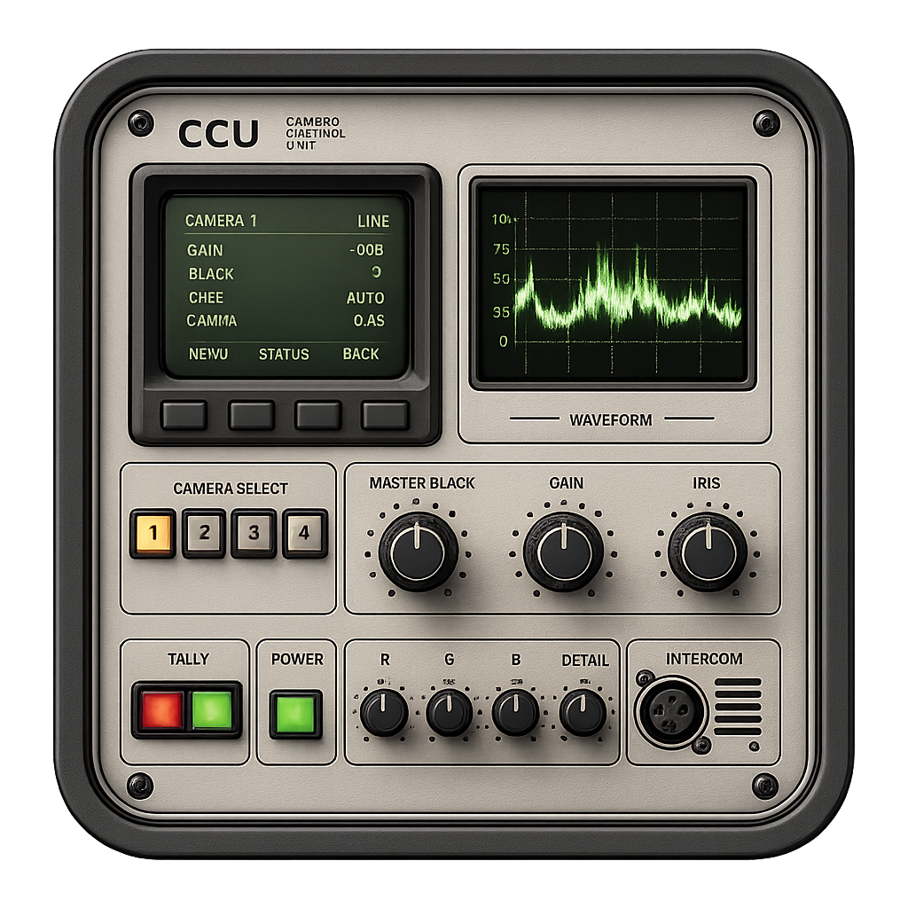

<p align="center">
  
</p>

# CCU OBS

Plugin de control de càmeres per a OBS Studio. Reuneix fins a quatre fonts de
vídeo en una finestra CCU, permet comparar-les simultàniament i aplica
correccions persistents a la font original.

La versió actual és **0.2.6** i està orientada a proves en macOS. El disseny
tècnic evita API exclusives de macOS per facilitar la futura versió Windows.

## Funcions actuals

- Finestra independent oberta des del menú d'eines d'OBS.
- Quatre visors 16:9 que reutilitzen fonts ja obertes per OBS.
- Assignació independent de fonts i selecció de la càmera activa.
- Controls RGB, brillantor, contrast, gamma i saturació.
- Aplicació immediata mitjançant un filtre GPU propi.
- Comptagotes restringit al rectangle real del vídeo.
- Lupa aproximada de 18×, retícula i punt central de selecció.
- Vista ampliada de la càmera activa.
- Persistència del filtre a la font i de les assignacions del CCU.
- Finestra centrada al 85% de l'àrea útil de la pantalla.

## Ús ràpid

1. Obre OBS i selecciona **Eines → CCU OBS…**.
2. Assigna una font a cada visor i selecciona la càmera activa amb els botons
   `1`–`4` o clicant el visor.
3. Mou els controls. El plugin afegeix a la font un filtre propi `CCU OBS`.
4. Activa **Comptagotes** i clica un blanc o gris neutre. Els marges i les
   bandes negres no accepten clics.
5. Utilitza **Lupa** per ampliar temporalment la càmera activa.

Els canvis afecten totes les aparicions de la font: preview, programa,
gravació i emissió.

## Documentació

- [Guia d'ús i instal·lació](docs/USER_GUIDE.md)
- [Arquitectura tècnica](docs/ARCHITECTURE.md)
- [Desenvolupament, compilació i proves](docs/DEVELOPMENT.md)
- [Estat, limitacions i full de ruta](docs/ROADMAP.md)
- [Especificació inicial del projecte](projecte%20CCU%20OBS.md)

## Compilació ràpida

El projecte utilitza CMake, libobs, l'API frontend d'OBS i Qt 6:

```sh
cmake -S . -B build-release -G Ninja \
  -DCMAKE_BUILD_TYPE=Release \
  -DCMAKE_OSX_ARCHITECTURES="arm64;x86_64" \
  -Dlibobs_DIR="/path/to/libobs/cmake" \
  -Dobs-frontend-api_DIR="/path/to/obs-frontend-api/cmake" \
  -DQt6_DIR="/path/to/Qt6/lib/cmake/Qt6"
cmake --build build-release
ctest --test-dir build-release --output-on-failure
```

El bundle resultant és `build-release/obs-ccu.plugin`.

## Estat

La correcció de color, la persistència, els quatre visors i el selector han
estat provats en OBS Studio 32.2 sobre Apple Silicon. La interfície encara és
funcional i provisional; l'estètica de CCU físic antic queda reservada per a
una fase posterior.

## Llicència

Projecte privat en desenvolupament. No es concedeixen drets de redistribució
fins que el repositori incorpori una llicència explícita.
